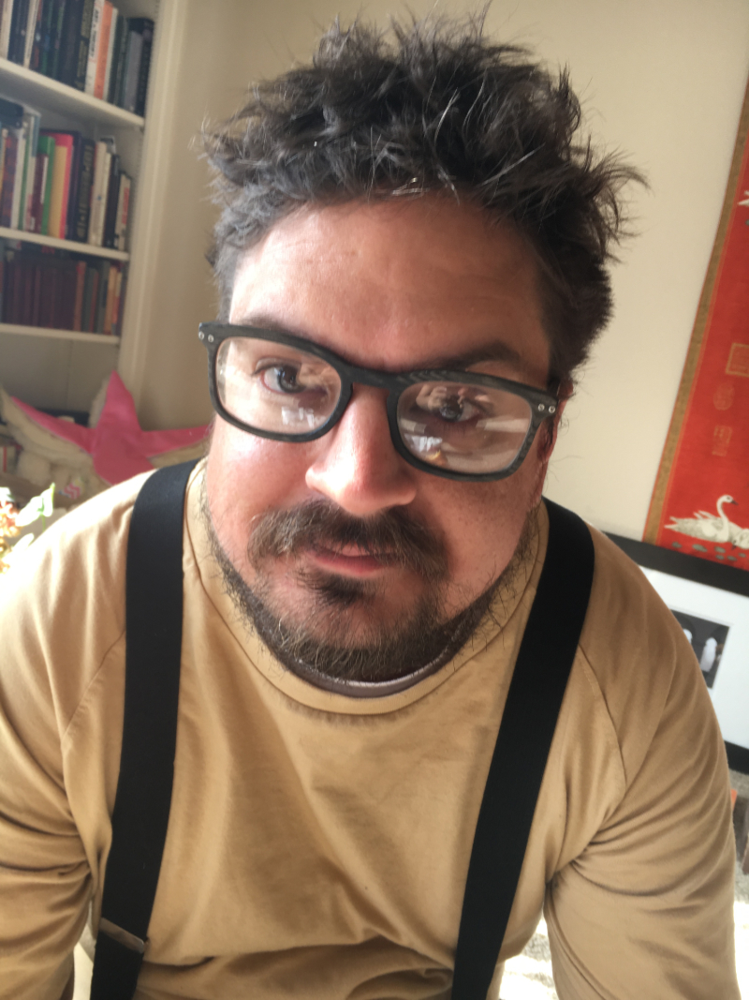

# About Me

---

  

I'm a coder, designer, and artist living and working in Santa Fe, New Mexico. I fuse technology and art to create experiences that engage people on a deep level and delight them in unexpected ways.

In my current work as the Interactive Design Manager at Meow Wolf, I lead the team that translates big ideas into digital and real world immersive experiences. When I was the Sr. Web Developer I put together the front end tech stack for Meow Wolf's fun, animated, and futuristic websites. 

Currently, I've been diving into VR and AR experiences looking for cool ways to communicate effectively in those new mediums. My wife and I are currently building some immersive experiences for the Oculus Quest using Unity. Stay tuned! Check out my wife's website here. 
