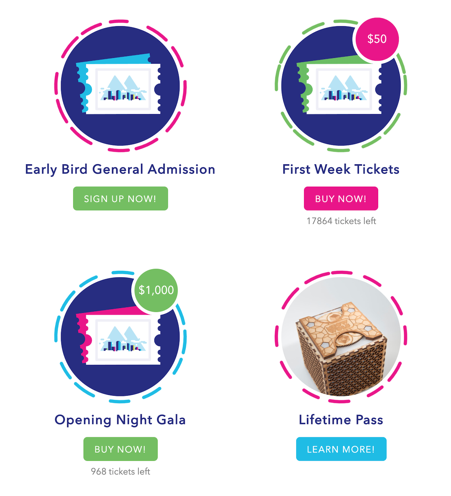
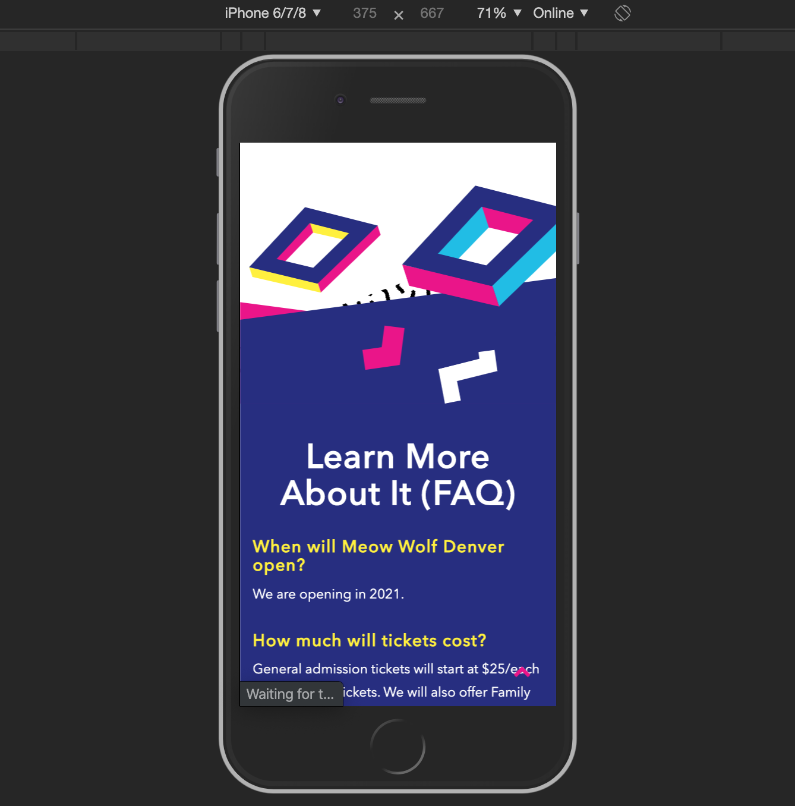

import Video from "../components/Video"

# Meow Wolf Denver

> Codebase: PHP (Wordpress), JS, LESS

I was a lead front end developer for this project, which was tons of fun. Denver was an exciting challenge as there was a requirement that it have a lot of motion and movement.

Our design team came up with what the animations should be and part of our challenge was to translate the animation suggestions into actual experience.

After much research, we decided to use GreenSock to custom build out all the animations shown below.

<Video type="youtube" url="b_l5cAkJhvU" />

## Examples

```js
/**
 * Poof animation for Slider Titles.
 *
 * @function betterPoof
 * @public
 * @param {Object} el - The element to animate.
 * @param {number} step - 0,1,2 which are 'init', 'beforeChange', and 'afterChange' on the slider.
 */
var betterPoof = function betterPoof(el, step) {
  var tl = new TimelineMax()
  var test = document.querySelector(el).innerHTML.split(" ")
  switch (step) {
    case 0:
    default:
      tl.to(el, 0.1, {
        autoAlpha: 1,
        filter: "blur(0px)",
      })
      break
    case 1:
      tl.to(el, 0.01, {
        autoAlpha: 0,
        filter: "blur(14px)",
      })
      tl.to(
        el,
        0.2,
        {
          autoAlpha: 1,
        },
        0.425
      )
      tl.to(el, 0.5, {
        filter: "blur(0px)",
      })
      break
  }
}

/**
 * Animate highlight lines.
 *
 * @function highlightAnim
 * @private
 * @param {Object} SMController - The Controller Object for ScrollMagic.
 */
var highlightAnim = function highlightAnim(SMController) {
  pathPrepare("#line-1 .cls-1")
  pathPrepare("#line-2 .cls-1")

  var timeline = new TimelineMax()
  var tween1 = TweenMax.to("#line-1 .cls-1", 1.5, {
    strokeDashoffset: 0,
  })
  var tween2 = TweenMax.to("#line-2 .cls-1", 1.5, {
    strokeDashoffset: 0,
  })
  var tween3 = TweenMax.to("#line-1 .cls-1", 0.1, {
    autoAlpha: 1,
  })
  var tween4 = TweenMax.to("#line-2 .cls-1", 0.1, {
    autoAlpha: 1,
  })
  timeline.add(tween1, 1)
  timeline.add(tween2, 0.5)
  timeline.add(tween3, 1)
  timeline.add(tween4, 0.5)

  var scene = new ScrollMagic.Scene({
    triggerElement: ".highlight",
    duration: 650,
  })
  scene.setTween(timeline)
  scene.addTo(SMController)
}
```

## Additional mages

<div className="auto-grid">
  
  
</div>
