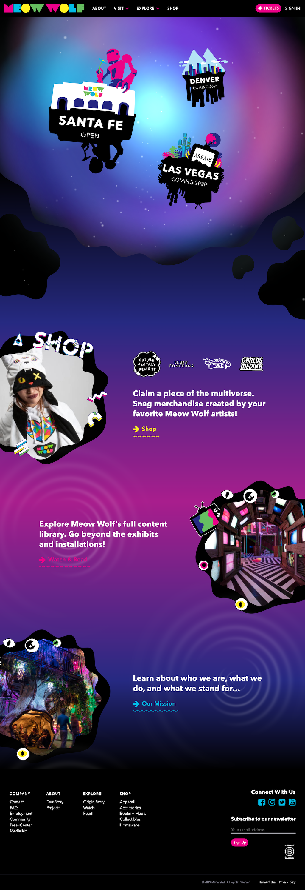
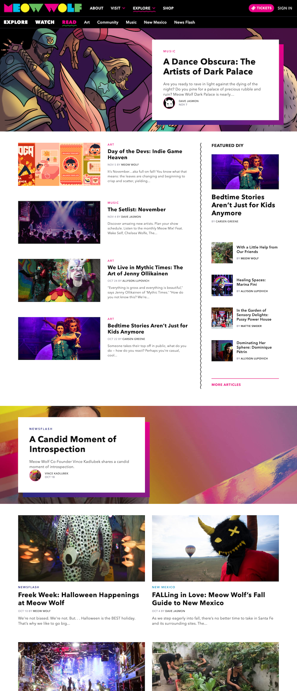
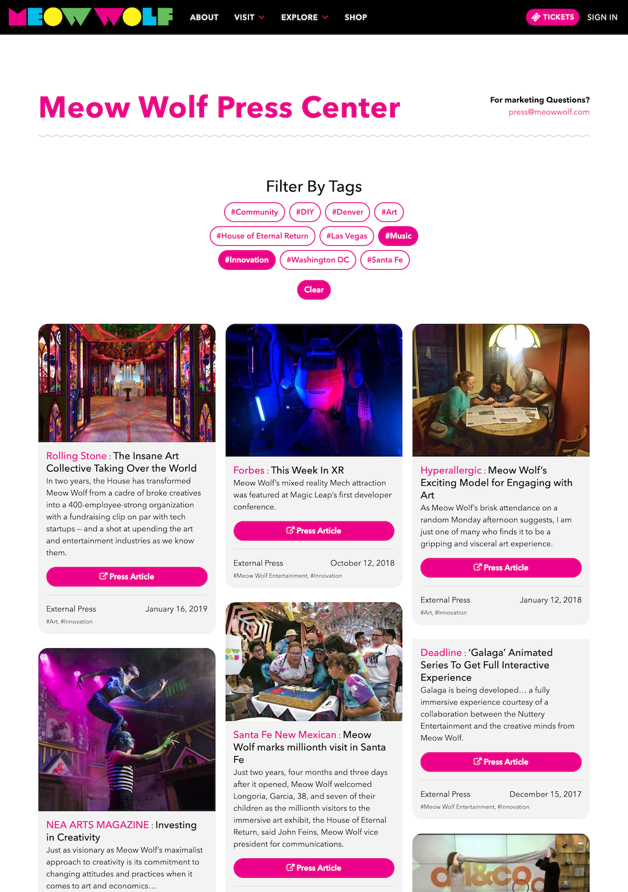
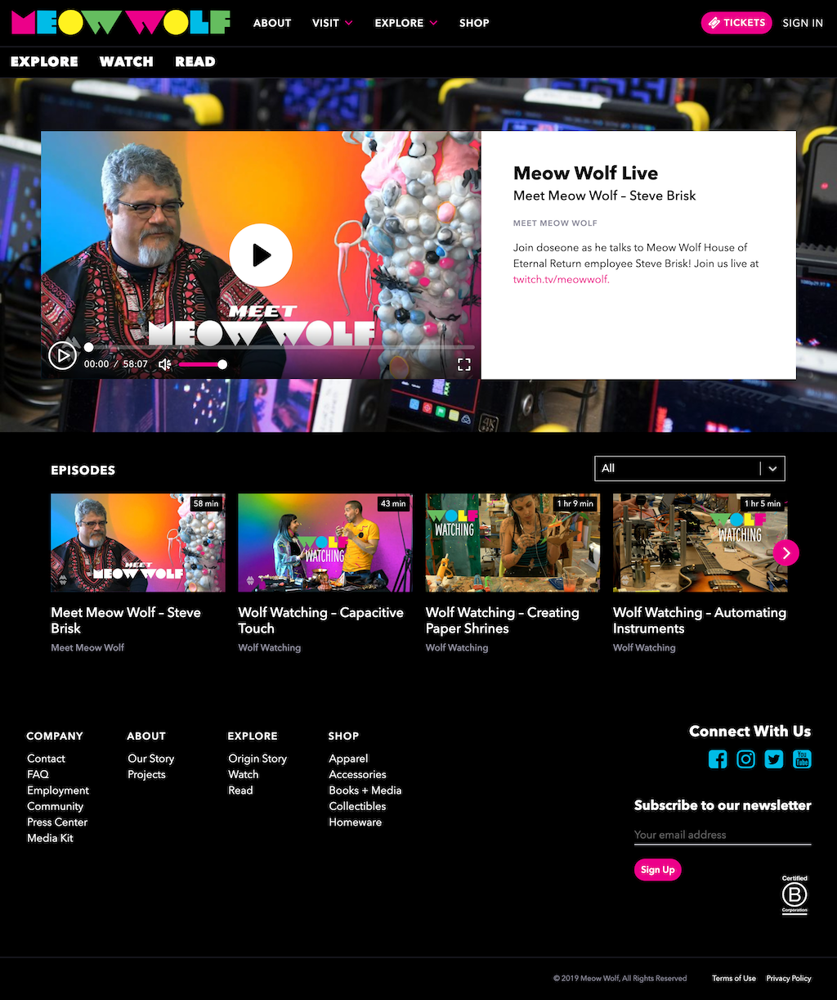

import Video from "../components/Video"

::: div fixed-width

# Meow Wolf Main Site

---

::: div auto-grid

::: div

In 2018, I was the lead front-end developer working on a complete rebrand and rebuild of our main website https://meowwolf.com. It was a big project that would see us hook a wordpress headless backend cms to graphql to a dynamic react front.

I've included some details on this page of pieces I particularly enjoyed building.

## Lottie Animations

I was able to integrate complex animations that our visual designer made in After Effects into the site using the Lottie animation library (formerly BodyMovin so you might see it called that as well).

I made a custom react component that imported the library, waited for the correct inner image to come in from graphql, and used InteractionObserver tooling to only load once in view. It made for many of hte really nice animations you see throughout the site.

<Video type="youtube" url="0jpouKmBA_A" />

## Card description

I just really like how this turned out. The animations feel good and smooth.

<Video type="youtube" url="Z9j7nPyMaJw" />

## Projects page

One of my favorite pages on teh site is https://meowwolf.com/projects. Here I used a combo of lots of advanced css stuff including animations + intersection observer + custom JS for the really delicious blobs that come out of the years after a few seconds.

<Video type="youtube" url="jlZcYXm4wZQ" />

:::

::: div

> Codebase: React (Next.js), Apollo Graphql, SCSS, Lottie, Pixi.js, tilt.js

The home page is one of the most complex pages in that is uses a combo of SVGs, pixi.js (for the glowing background starfield at the top), Lottie animations, tilt.js, css animations, Intersection Observer, and lots of css tricks to make a really engaging entry into the meow wolf multiverse.

:::

:::

## Additional Details

::: div auto-grid

:::

:::