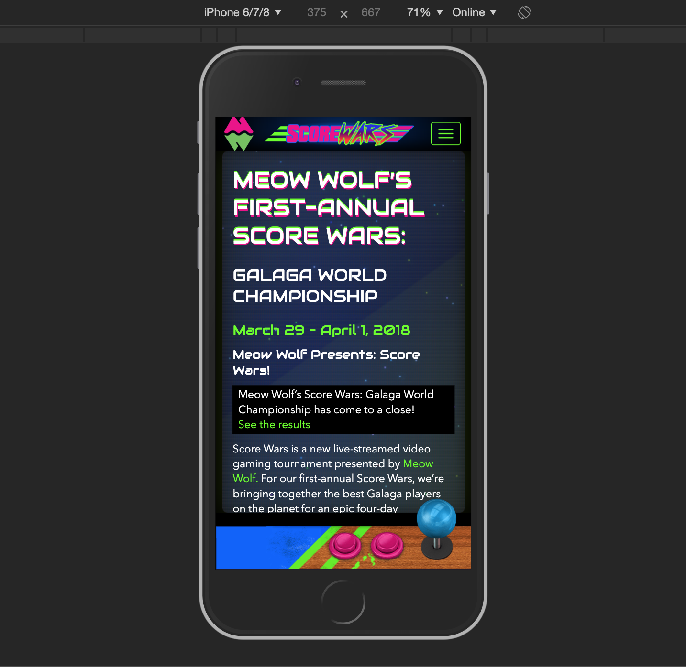

import Video from "../components/Video"

# Score Wars

> Codebase: PHP (Wordpress), JS, LESS

ScoreWars.com is a site that I was the lead Front End developer on. It was in the old times..the before times, 2 years ago. When the team was still small and SPAs were in full swing. The site had some really fun aspects to it that were challenges to figure out.

One of the main challenges was how to make it feel like an actual Arcade cabinet across devices. The way we approached it was to focus on the controls of the "cabinet", and on the flickering screen / monitor. The video below shows both of these, so check it out, but its easier to see how it works by actually going to ScoreWars.com.

<Video type="youtube" url="FfaNMZXviR0" />

## The Controls

Bear in mind this was in the good old days before flex and grid became super solid. Also note, this site is based on bootstrap 3 and needed to work well within that framework. I've come to rely less and less on frameworks over the years as it tends to be so much bulk and locks you into a specific moment in time. It's a bit of a hack, but ends up working out nicely.

```less
// Tablets and above handle the controls in one way
@media only screen and (max-width: @screen-sm-max) {
  .footer-container {
    height: 128px;

    .site-footer {
      .game-button-left {
        height: 128px;
      }
      .meow-callout {
        align-items: left;
        text-align: left;
        height: 92px;
        .meow-logo-shadow {
          width: 80%;
        }
      }
      .game-button-right {
        height: 150px;
      }
    }
  }
}
```

```less
// Phones then make adjustments
@media only screen and (max-width: @screen-xs-max) {
  .footer-container {
    height: 63px;
    border-top: 17px solid #015dfd;
    box-shadow: 0px 0px 0px 20px #000;

    .site-footer {
      .game-button-left {
        height: 100px;
      }
      .meow-callout {
        height: 65px;
        top: -17px;
        h5 {
          margin: 0;
        }
        .meow-logo-shadow {
          margin-top: 3px;
          width: 60%;
        }
      }
      .game-button-right {
        height: 104px;
      }
    }
  }
}
```

```less
// Tiny Devices (older phones) need a little extra,
// by removing the meow wolf logo.
@media only screen and (max-width: 480px) {
  .meow-callout {
    display: none !important;
  }
}
```

```less
// And we also need to take care of landscape orientated devices
@media only screen and (max-width: @screen-xs-max) and (orientation: landscape) {
  .footer-container {
    height: 49px;
    border-top: 27px solid #015dfd;
    box-shadow: 0px 0px 0px 14px #000;
    .site-footer {
      .game-button-left {
        display: block !important;
        height: 49px;
      }
      .game-button-right {
        height: 81px;
      }
    }
  }
}
```

## The flickering Screen

The flickering screen itself is entirely css based, using a single class + the `:before` and `:after` pseudo-selectors.

Here's the general setup:

```less
// The screen shine and the corner shadows
.screen {
  background: linear-gradient(
    145deg,
    rgba(173, 233, 6, 0.13) 0%,
    rgba(173, 233, 6, 0.05) 50%,
    rgba(173, 233, 6, 0.1) 50.5%,
    rgba(173, 233, 6, 0.214) 100%
  );
  box-shadow: inset 0px 0px 18.5vw 0vw rgba(0, 0, 0, 0.572), inset 0px 0px 4.5vw
      0vw rgba(0, 0, 0, 0.7), 0px 0px 0px 13vw #000000;
  border-radius: 2.5vw;
  pointer-events: none;
  position: fixed;
  top: 80px;
  margin: 0 2.5%;
  width: 95%;
  z-index: 0;
}

// The screen grid
.screen::before {
  _content_: " ";
  display: block;
  position: absolute;
  top: 0;
  left: 0;
  bottom: 0;
  right: 0;
  background: linear-gradient(
      rgba(18, 16, 16, 0) 50%,
      rgba(71, 71, 71, 0.25) 50%
    ), linear-gradient(90deg, rgba(255, 0, 0, 0.06), rgba(0, 255, 0, 0.02), rgba(0, 0, 255, 0.06));
  z-index: 2;
  background-size: 100% 2px, 3px 100%;
  pointer-events: none;
  border-radius: 1.9vw;
  box-shadow: 0px 0px 11vw rgba(173, 233, 6, 0.18);
}

// The animation
.screen::after {
  _content_: " ";
  display: block;
  position: absolute;
  top: 0;
  left: 0;
  bottom: 0;
  right: 0;
  background: rgba(87, 90, 86, 0.2);
  opacity: 0;
  z-index: 2;
  pointer-events: none;
  animation: flicker 6s infinite;
  border-radius: 1.9vw;
}

// Custom CRT flicker from http://aleclownes.com/2017/02/01/crt-display.html
@keyframes flicker {
  0% {
    opacity: 0.27861;
  }
  5% {
    opacity: 0.34769;
  }
  10% {
    opacity: 0.23604;
  }
  15% {
    opacity: 0.40626;
  }
  20% {
    opacity: 0.18128;
  }
  25% {
    opacity: 0.53891;
  }
  30% {
    opacity: 0.45583;
  }
  35% {
    opacity: 0.47807;
  }
  40% {
    opacity: 0.26559;
  }
  45% {
    opacity: 0.54693;
  }
  50% {
    opacity: 0.46019;
  }
  55% {
    opacity: 0.08594;
  }
  60% {
    opacity: 0.20313;
  }
  65% {
    opacity: 0.41988;
  }
  70% {
    opacity: 0.53455;
  }
  75% {
    opacity: 0.37288;
  }
  80% {
    opacity: 0.51428;
  }
  85% {
    opacity: 0.40419;
  }
  90% {
    opacity: 0.1003;
  }
  95% {
    opacity: 0.36108;
  }
  100% {
    opacity: 0.24387;
  }
}
```

## Additional Images

<div className="auto-grid">
  
</div>
