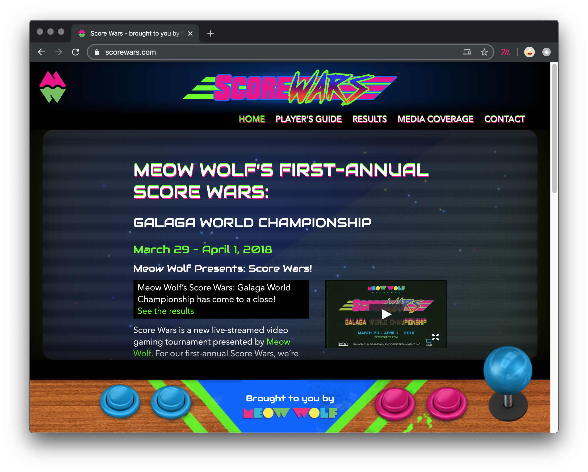

import Video from "../components/Video"

<div className="">
  
</div>

# Scorewars

ScoreWars.com is a site that I was the lead Front End developer on. It had some really fun aspects to it that were challenges to figure out.

One of the main challenges was how to make it feel like an actual Arcade cabinet across devices. The way we approached it was to focus on the controls of the "cabinet", and on the flickering screen / monitor. The video below shows both of these, so check it out, but its easier to see how it works by actually going to ScoreWars.com.

Bear in mind this was in the good old days before flex and grid became super solid. Also note, this site is based on bootstrap 3 and needed to work well within that framework. I've come to rely less and less on frameworks over the years as it tends to be so much bulk and locks you into a specific moment in time.

<Video type="youtube" url="FfaNMZXviR0" />

```less
// Tablets and above handle the controls in one way
@media only screen and (max-width: @screen-sm-max) {
  .footer-container {
    height: 128px;

    .site-footer {
      .game-button-left {
        height: 128px;
      }
      .meow-callout {
        align-items: left;
        text-align: left;
        height: 92px;
        .meow-logo-shadow {
          width: 80%;
        }
      }
      .game-button-right {
        height: 150px;
      }
    }
  }
}
```

```less
// Phones then make adjustments
@media only screen and (max-width: @screen-xs-max) {
  .footer-container {
    height: 63px;
    border-top: 17px solid #015dfd;
    box-shadow: 0px 0px 0px 20px #000;

    .site-footer {
      .game-button-left {
        height: 100px;
      }
      .meow-callout {
        height: 65px;
        top: -17px;
        h5 {
          margin: 0;
        }
        .meow-logo-shadow {
          margin-top: 3px;
          width: 60%;
        }
      }
      .game-button-right {
        height: 104px;
      }
    }
  }
}
```

```less
// Tiny Devices (older phones) need a little extra,
// by removing the meow wolf logo.
@media only screen and (max-width: 480px) {
  .meow-callout {
    display: none !important;
  }
}
```

```less
// And we also need to take care of landscape orientated devices
@media only screen and (max-width: @screen-xs-max) and (orientation: landscape) {
  .footer-container {
    height: 49px;
    border-top: 27px solid #015dfd;
    box-shadow: 0px 0px 0px 14px #000;
    .site-footer {
      .game-button-left {
        display: block !important;
        height: 49px;
      }
      .game-button-right {
        height: 81px;
      }
    }
  }
}
```
