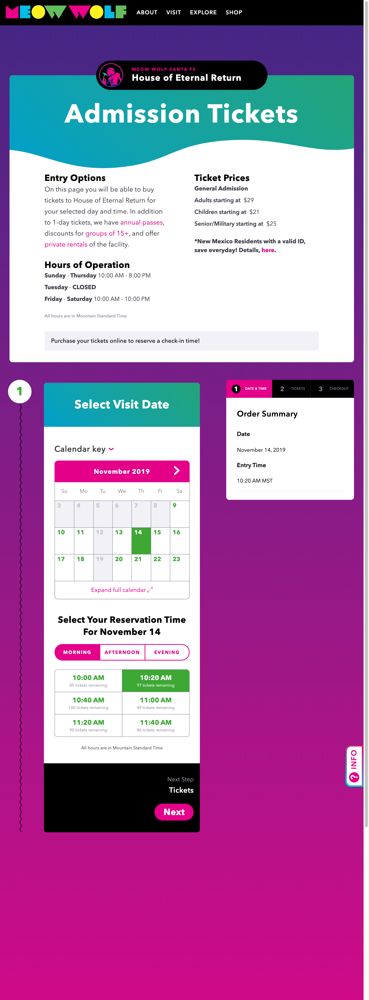

import Video from "../components/Video"

# Meow Wolf Tickets

---

::: div auto-grid

::: div

Recently, we finished building a new Ticketing system for Meow Wolf. I was able to help setup the foundations and systems we used including TypeScript, and Unit testing via react-testing-library, integration testing via Cypress, etc...

I also lead front end dev on this until I transitioned into my current role as interactive design manager. It was lots of fun and by using TypeScript we got a lot of stability and ease of maintenance for free.

[Check out https://tickets.meowwolf.com](https://tickets.meowwolf.com)

## Example

Here's a typical example of the types of components that make up the ticketing system in React / TypeScript.

### Unit Test

```typescript
import React from "react"
import { render } from "react-testing-library"
import Card from "./Card"

it("renders a basic card properly", () => {
  const { getByText, getByTestId, container } = render(
    <Card
      title="test title"
      subtitle="test subtitle"
      description="test sentences are good."
    />
  )

  const title = getByTestId(`title-${title}`)
  const subtitle = getByTestId(`subtitle-${subTitle}`)
  const description = getByTestId(`description-${description}`)

  expect(title).toHaveTextContent("test title")
  expect(subtitle).toHaveTextContent("test subtitle")
  expect(description).toHaveTextContent("test sentences are good.")
})
```

### Component

```typescript
import React, { FunctionComponent } from "react"
import "./styles.scss"

// Interface
export interface CardProps {
  title?: string
  subtitle?: string
  description?: string
}

// Component
const Card: FunctionComponent<CardProps> = (props: CardProps) => {
  const { title, subtitle, description } = props

  return (
    <div className="card">
      {title && (
        <h1 className="title" data-testid={`title-${title}`}>
          {title}
        </h1>
      )}

      {subtitle && (
        <h2 className="subtitle" data-testid={`subtitle-${subTitle}`}>
          {subtitle}
        </h2>
      )}

      {description && (
        <div className="description" data-testid={`description-${description}`}>
          {description}
        </div>
      )}
    </div>
  )
}

export default Card
```

:::

::: div

> Codebase: React (Next.js), TypeScript, Apollo Graphql, SCSS

[](https://tickets.meowwolf.com)

:::

:::
